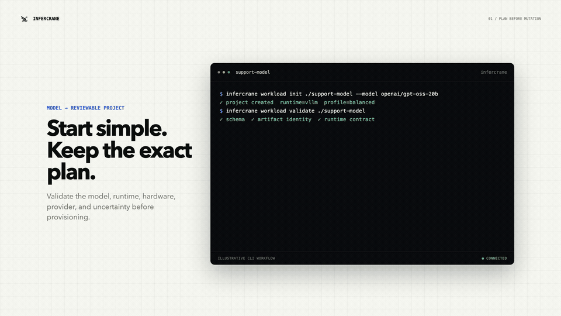

<p align="center">
  <picture>
    <source media="(prefers-color-scheme: dark)" srcset="docs/assets/infercrane-logo-dark.svg">
    
  </picture>
</p>

<p align="center">
  <strong>Give InferCrane a model. Get a production endpoint.</strong>
</p>

<p align="center">
  Open-source infrastructure for deploying, operating, optimizing, and safely evolving<br>
  open-weight and custom-model inference behind one stable OpenAI-compatible endpoint.
</p>

<p align="center">
  <a href="LICENSE"></a>
  <a href="https://github.com/infercrane/infercrane/actions/workflows/quality.yml"></a>
  <a href="https://docs.infercrane.com"></a>
  <a href="https://github.com/infercrane/infercrane/stargazers"></a>
</p>

<p align="center">
  <a href="#install">Run the five-minute local proof</a>
  · <a href="https://docs.infercrane.com/quickstart">Read the quickstart</a>
</p>

<p align="center">
  
  <br>
  <sub>Plan before mutation · survive disconnects · explain latency · guard every release</sub>
</p>

## Install

Coming with the `v1.0.0` release: `brew install infercrane/tap/infercrane`, release archives, and
published Python and TypeScript SDKs. Until then, run the local proof with Git and Docker Compose v2.
It uses GPU-free workers and creates no cloud resources:

```bash
git clone https://github.com/infercrane/infercrane.git
cd infercrane
make demo
```

The proof connects an OpenAI-compatible worker, sends and inspects a request, creates an isolated
candidate, records a deterministic Release Guard rejection, verifies that production traffic did
not move, and removes its disposable stack.

InferCrane is the open-source control plane for self-hosted model inference. Your application keeps
one model identity while InferCrane changes the model artifact, runtime, accelerator, provider,
replica count, and active revision underneath it.

- **Deploy or adopt:** operate vLLM, SGLang, custom OCI, and compatible existing endpoints across
  AWS, GCP, Kubernetes, and RunPod.
- **Keep one endpoint:** route revisions and providers behind a stable OpenAI-compatible contract.
- **Prove every change:** persist request, benchmark, quality, cost, and rollout evidence before
  promotion—and preserve the active revision when evidence is missing.

## Why not just…

- **Raw vLLM and Kubernetes:** the serving engine and manifests do not by themselves provide an
  evidence-gated release lifecycle. InferCrane adds deterministic promotion, rejection, rollback,
  and a persisted record of what changed.
- **LiteLLM:** it is an excellent routing layer. InferCrane additionally owns deployment lifecycle,
  evidence-gated promotion, and rollback; it can also connect to an existing LiteLLM endpoint
  without taking infrastructure ownership.
- **A managed inference platform:** it is often the right choice when a team wants the provider to
  operate its infrastructure. InferCrane is for teams that want the control plane, capacity, and
  billing boundary to remain in infrastructure they own.
- **Scripts and CI:** scripts can deploy a revision. InferCrane standardizes the durable
  reject/promote/rollback decision and the evidence attached to it.

See the [detailed comparison](docs/compare.mdx), including the boundaries InferCrane does not own.

The local proof needs no GPU or cloud account. Real-provider support remains exact-tuple qualified;
InferCrane reports missing model/runtime/hardware evidence as unknown instead of turning it into a
compatibility claim.

<details>
<summary><strong>See the system boundary</strong></summary>

```text
Applications and agents
          │
          ▼
Stable OpenAI-compatible endpoint
          │
          ▼
InferCrane: route · observe · optimize · release · recover
          │
          ├── deploy new inference
          ├── adopt an existing workload
          └── govern a model API or gateway
          │
          ▼
vLLM · SGLang · custom OCI · experimental Dynamo
AWS · GCP · Kubernetes · RunPod · existing infrastructure
```

</details>

## Start with the job you need to do

| Goal | InferCrane workflow |
|---|---|
| Put a model into production | Initialize a workload, review the serving plan, deploy, then call its stable endpoint. |
| Adopt existing inference | Connect vLLM, SGLang, LiteLLM, or another compatible endpoint without transferring lifecycle ownership. |
| Ship a safer revision | Benchmark and replay an isolated candidate, attach quality evidence, then let Release Guard promote or reject it. |
| Understand production failures | Trace queue wait, attempts, runtime, revision, latency, saturation, and durable operations without storing prompt content. |
| Optimize performance and cost | Propose serving configurations, measure comparable candidates on real hardware, and persist only qualified evidence. |
| Survive infrastructure delays | Submit idempotent durable operations that continue after the CLI or control plane process disconnects. |

<p align="center">
  
</p>

Local fixtures prove application and lifecycle behavior. They do not prove GPU performance, cloud
capacity, runtime compatibility, or model quality. InferCrane keeps those evidence boundaries
explicit.

## From model to endpoint

Start with a curated recipe:

```bash
infercrane workload init ./support --recipe qwen3-8b
cd support
infercrane workload plan
infercrane workload deploy --wait
```

Or bring another compatible immutable model identity:

```bash
infercrane workload init ./agent-model --model mistralai/Mistral-7B-Instruct-v0.3
cd agent-model
infercrane workload plan
infercrane workload deploy --wait
```

Recipes are reproducible configuration starting points, not benchmark claims or an allowlist.
Evidence remains bound to the exact model commit, runtime, accelerator, provider, cache state, and
workload.

Already operating a workload? Connect it first:

```bash
infercrane connect https://vllm.internal/v1 --as support-production
infercrane doctor support-production
infercrane observe support-production
```

InferCrane can observe an existing endpoint before it manages traffic or infrastructure. Provider
credentials and request content do not enter the browser console.

## Optimize, then prove

InferCrane separates a modeled proposal from measured and qualified evidence:

```bash
infercrane optimize propose llama-3.1-8b-instruct \
  --provider aws \
  --region eu-central-1 \
  --gpu L40S \
  --objective interactive \
  --write-dir .infercrane/candidates
```

```text
model + hardware + workload + SLO + cost target
                       │
                       ▼
              candidate serving plans
                       │
                       ▼
          AIPerf + replay + quality evidence
                       │
                       ▼
            performance · errors · cost
                       │
                 ┌─────┴─────┐
                 ▼           ▼
              promote      reject
```

InferCrane composes replaceable execution technology instead of rebuilding it. vLLM, SGLang, and
custom OCI are current execution paths. Dynamo is experimental. TensorRT-LLM, LMCache, NIXL, and
external optimizers remain capability boundaries until their exact adapters and hardware tuples are
qualified. InferCrane owns serving-plan identity, durable operations, comparable evidence, routing
policy, promotion, and rollback.

## Production properties

- **Stable endpoint identity:** applications do not change when the serving plan changes.
- **Bounded overload:** admission limits, explicit `429` and `Retry-After`, one end-to-end deadline,
  and bounded retries prevent unlimited queue growth.
- **Request-path isolation:** gateways route from immutable in-memory snapshots and never query
  PostgreSQL on the inference request path.
- **Durable operations:** deployment, scaling, deletion, and release work is idempotent,
  restart-safe, cancellable, and inspectable.
- **Release evidence:** benchmark, replay, quality, reliability, and sourced cost evidence can block
  a candidate before traffic moves.
- **Content-free operations:** request evidence records operational metadata without persisting
  prompts or model outputs.
- **Explicit ownership:** existing runtimes, gateways, training systems, sandboxes, and clouds stay
  replaceable behind versioned contracts.

Read the [architecture](https://docs.infercrane.com/architecture/system),
[system invariants](docs/architecture/invariants.md), and
[data flows](docs/architecture/data-flows.md) for the complete design.

## Interfaces

| Interface | Status and purpose |
|---|---|
| CLI and control API | Primary deployment, operation, evidence, and administration interfaces. |
| OpenAI-compatible gateway | Capability-gated Chat, Completions, Embeddings, Responses, and online batch paths. The pinned vLLM profile currently qualifies Chat plus model-compatible Completions and Embeddings; unsupported capabilities fail before upstream transmission. |
| Python and TypeScript SDKs | Generated from the checked OpenAPI contract and built in CI. Public package publication is pending. |
| Terraform provider | Logical deployment lifecycle with guarded updates and import. Registry publication is pending. |
| Terminal workspace | Fleet attention, evidence inspection, and state-valid guarded actions. |
| Browser console | Separate deny-by-default private-preview application using the same control API. |
| Read-only MCP server | Closed-world operational inspection without deployment, scaling, promotion, deletion, budget, or secret tools. |

## Qualification status

InferCrane is preparing its first public stable release, `v1.0.0`. The current `main` branch is the
launch product; no earlier development tag should be treated as a supported public release.

- Local race, PostgreSQL, fault-injection, Docker, Kind, KWOK, package, migration, security, and
  documentation gates are automated.
- AWS has exact-tuple real GPU evidence for vLLM, SGLang, custom OCI, model identity, requests,
  bounded benchmarks, durable deletion, and final zero managed-resource inventory.
- GCP GPU, real GPU Kubernetes/KServe, additional model/runtime/GPU tuples, and several distributed
  optimization paths still require separate real-infrastructure evidence.
- No benchmark is generalized beyond the exact tuple and workload that produced it.

See the authoritative [compatibility and qualification policy](docs/compatibility.md),
[AWS evidence](docs/testing/aws-real-evidence.md), and
[feature qualification matrix](docs/testing/feature-qualification-matrix.md) before relying on an
exact provider, runtime, model, or accelerator combination.

## Documentation

- [Five-minute quickstart](https://docs.infercrane.com/quickstart)
- [Product concepts](https://docs.infercrane.com/concepts)
- [Build new inference](https://docs.infercrane.com/showcase/build-inference)
- [Connect existing inference](https://docs.infercrane.com/showcase/connect-existing)
- [Safe releases](https://docs.infercrane.com/showcase/safe-rollouts)
- [Provider setup](https://docs.infercrane.com/provider-setup)
- [Production operations](https://docs.infercrane.com/production)
- [Python SDK](https://docs.infercrane.com/integrations/python)
- [TypeScript SDK](https://docs.infercrane.com/integrations/typescript)
- [Terraform provider](https://docs.infercrane.com/integrations/terraform)
- [Security](SECURITY.md)
- [Support](SUPPORT.md)

Mintlify generates [`llms.txt`](https://docs.infercrane.com/llms.txt) and
[`llms-full.txt`](https://docs.infercrane.com/llms-full.txt) from the public documentation. Every
public documentation page is also available as Markdown by appending `.md` to its URL.

## Contributing

Contributions are welcome. Start with [CONTRIBUTING.md](CONTRIBUTING.md), follow the
[Code of Conduct](CODE_OF_CONDUCT.md), and sign commits with `git commit -s`. Changes must include
tests and relevant documentation. Durable architecture, security, storage, and dependency changes
must update their authoritative public documentation.

## Security and support

Never disclose credentials, prompts, model responses, private endpoints, or suspected
vulnerabilities in a public issue. Use the private reporting process in [SECURITY.md](SECURITY.md).
Questions and reproducible defects follow [SUPPORT.md](SUPPORT.md).

## License

InferCrane Community is available under the [Apache License 2.0](LICENSE). Hosted and enterprise products
are separate distributions and are not licensed by this repository. Release archives also include
[third-party notices](THIRD_PARTY_NOTICES.md) and a release-specific SPDX SBOM. The InferCrane name
and crane logo remain subject to the [trademark policy](TRADEMARKS.md).
