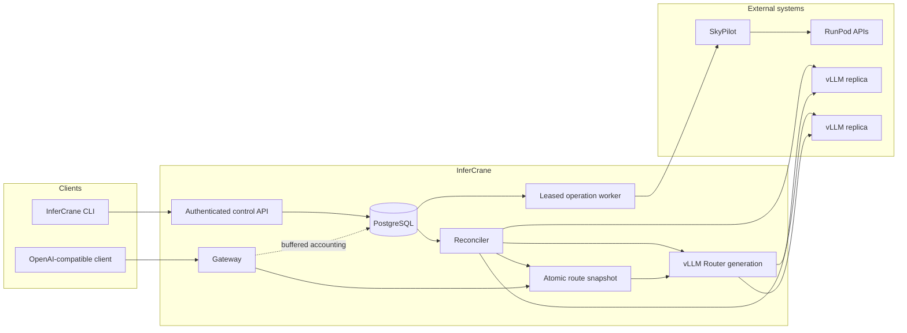

# Architecture

InferCrane separates durable deployment decisions from latency-sensitive inference routing. PostgreSQL is authoritative for the control plane; an atomic in-memory snapshot is authoritative for each gateway replica's request path.

## Control plane

The CLI submits authenticated API operations. PostgreSQL stores desired and observed deployment state, immutable revisions, replicas, operations, events, policy evaluations, and bounded measurements. A leased worker resumes pending provider work after process failure and reconciles results back into persisted state.

Provider ownership stays explicit:

- SkyPilot provisions elastic RunPod infrastructure.
- RunPod owns provider-native serverless worker allocation.
- Hugging Face tooling resolves and transfers model artifacts.
- AIPerf generates benchmark load.

InferCrane does not replace any of them with a general scheduler or workflow engine.

## Data plane

An OpenAI-compatible request resolves the logical model alias from an atomic route snapshot. It then passes to an instance-owned vLLM Router generation and a healthy vLLM worker. No PostgreSQL lookup occurs in that routing decision.

Each horizontally scaled gateway process owns its loopback router processes and deterministic ports. Gateway instances share PostgreSQL state, never another instance's local router.

## Request lifecycle

<Steps>
  <Step title="Authenticate and validate">
    The gateway authenticates the bearer token, validates the OpenAI request, and resolves the requested deployment alias.
  </Step>
  <Step title="Read one route snapshot">
    The route directory returns a ready generation without network or database I/O.
  </Step>
  <Step title="Route to a replica">
    vLLM Router applies the persisted strategy to its healthy standalone vLLM endpoints.
  </Step>
  <Step title="Stream without a write deadline">
    The gateway proxies the upstream response. Streaming responses are not constrained by the ordinary server write timeout.
  </Step>
  <Step title="Record bounded telemetry">
    Request accounting and normalized measurements enter bounded buffers and persist outside the routing decision.
  </Step>
</Steps>

## Safe route changes

The reconciler probes worker health and served-model identity, calculates membership, starts a candidate router generation, and only then publishes a new snapshot. Scale-down fences routing and drains the worker before provider termination. Failed candidates never replace the last healthy route.

<CardGroup cols={2}>
  <Card title="System invariants" icon="lock" href="/architecture/invariants">
    Read the rules every implementation change must preserve.
  </Card>
  <Card title="Architecture decisions" icon="landmark" href="/adr/index">
    Follow the reasoning behind persistence, tenancy, revisions, and operation execution.
  </Card>
</CardGroup>
