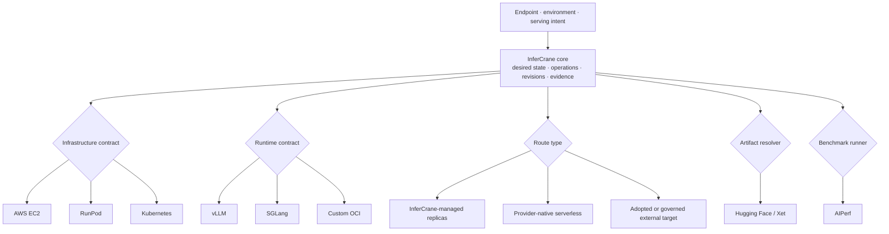

# Architecture

InferCrane separates durable deployment decisions from latency-sensitive inference routing. PostgreSQL is authoritative for the control plane; an atomic in-memory snapshot is authoritative for each gateway replica's request path.

## Control plane

The CLI, separately deployed web console, generated SDKs, Terraform provider, and GitHub delivery action use the
same authenticated API. None owns provider resources or reads PostgreSQL. PostgreSQL stores desired
and observed deployment state, immutable revisions, replicas, operations, events, policy
evaluations, and bounded measurements. A leased worker resumes pending provider work after process
failure and reconciles results back into persisted state.

External ownership stays explicit and replaceable behind narrow adapters:

- An elastic backend provisions and deletes replica infrastructure.
- A provider-native serverless backend owns worker allocation and scale-to-zero.
- An artifact resolver identifies and transfers immutable model artifacts.
- A benchmark runner generates load and returns reproducible evidence.

InferCrane does not replace any of them with a general scheduler or workflow engine. The process
composes registered elastic, serverless, external-target, runtime, artifact, and benchmark adapters.
RunPod, AWS EC2, and Kubernetes are current infrastructure adapters with different qualification
states; vLLM, SGLang, and custom OCI are current runtime profiles. Durable algorithms do not select
implementations with provider conditionals; [qualification is separate from registration](/adr/0009-qualified-support-and-backend-registration).

## A modular system, not a bundled stack

Users select a serving plan; adapters translate it into infrastructure-specific work. Core lifecycle
state does not depend on a RunPod, AWS, Kubernetes, vLLM, SGLang, or gateway-specific domain model.

| Layer | InferCrane owns | Integrated system owns |
| --- | --- | --- |
| Infrastructure | intent, durable identity, retries, reconciliation, cleanup evidence | compute allocation and provider API semantics |
| Runtime | capability contract, immutable configuration, readiness qualification | inference engine and model execution |
| Gateway or external target | stable endpoint identity, admission, policy, request evidence | optional protocol translation and its provider credentials |
| Artifact | immutable model identity and cache observations | transfer and provider-native storage primitives |
| Benchmark | reproduction record, comparison, policy input | load generation and raw measurement |

A user-managed LiteLLM deployment, for example, can be connected as an OpenAI-compatible external
gateway. InferCrane does not bundle or fork LiteLLM: it retains endpoint identity and operational
evidence while LiteLLM retains provider translation and its own configuration. See the
[existing-stack showcase](/showcase/connect-existing).

## Data plane

An OpenAI-compatible request resolves the logical model alias from an atomic route snapshot. For
standalone replica runtimes, it then passes to an instance-owned vLLM Router generation and a
healthy worker. Provider-native Serverless and governed external targets remain explicit route
types. No PostgreSQL lookup occurs in that routing decision.

Each horizontally scaled gateway process owns its loopback router processes and deterministic ports. Gateway instances share PostgreSQL state, never another instance's local router.

## Request lifecycle

<Steps>
  <Step title="Authenticate and validate">
    The gateway authenticates the bearer token, validates the OpenAI request, and resolves the requested deployment alias.
  </Step>
  <Step title="Read one route snapshot">
    The route directory returns a ready generation without network or database I/O.
  </Step>
  <Step title="Route to a replica">
    vLLM Router applies the persisted strategy to its healthy standalone vLLM endpoints.
  </Step>
  <Step title="Stream without a write deadline">
    The gateway proxies the upstream response. Streaming responses are not constrained by the ordinary server write timeout.
  </Step>
  <Step title="Record bounded telemetry">
    Request accounting and normalized measurements enter bounded buffers and persist outside the routing decision.
  </Step>
</Steps>

## Safe route changes

The reconciler probes worker health and served-model identity, calculates membership, starts a candidate router generation, and only then publishes a new snapshot. Scale-down fences routing and drains the worker before provider termination. Failed candidates never replace the last healthy route.

<CardGroup cols={2}>
  <Card title="System invariants" icon="lock" href="/architecture/invariants">
    Read the rules every implementation change must preserve.
  </Card>
  <Card title="Architecture decisions" icon="landmark" href="/adr/index">
    Follow the reasoning behind persistence, tenancy, revisions, and operation execution.
  </Card>
</CardGroup>
