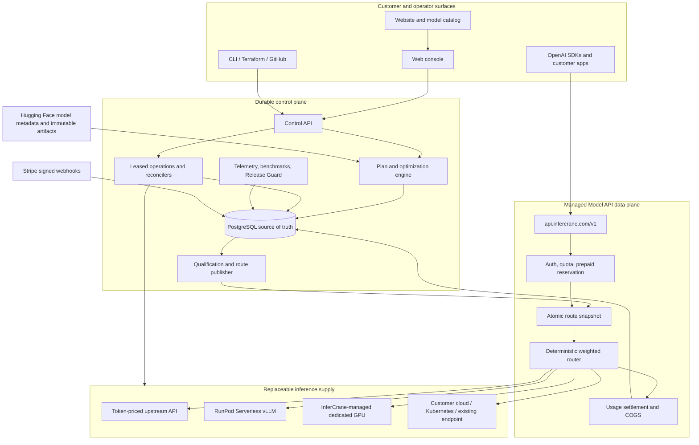

# Architecture

InferCrane separates durable deployment decisions from latency-sensitive inference routing.
PostgreSQL is authoritative for control-plane state. An atomic in-memory snapshot is authoritative
for each gateway replica's request path.

## Whole-product topology

The public model ID and API endpoint stay stable. The private route may move from an upstream API
to a qualified RunPod target and later to dedicated or BYOC capacity. That movement creates new
immutable target bindings and route publications; it never rewrites historical evidence.

<Tabs>
  <Tab title="Request path">
    

      
01 · application<strong>OpenAI client</strong>

      →
      
02 · stable identity<strong>logical endpoint</strong>

      →
      
03 · memory<strong>route snapshot</strong>

      →
      
04 · qualified<strong>runtime binding</strong>

    

    The gateway authenticates the request, resolves the logical model alias from one atomic route
    snapshot, and streams to a ready binding. **No PostgreSQL lookup occurs in this routing
    decision.**
  </Tab>

  <Tab title="Durable change">
    

      
01 · intent<strong>CLI / API</strong>

      →
      
02 · source of truth<strong>PostgreSQL</strong>

      →
      
03 · fenced<strong>leased operation</strong>

      →
      
04 · replaceable<strong>adapter</strong>

    

    Intent is committed before provider work begins. A leased worker resumes pending operations
    after process failure and reconciles the observed result into persisted state.
  </Tab>

  <Tab title="Recovery">
    

      
01 · failure<strong>client disconnect</strong>

      →
      
02 · durable<strong>persisted operation</strong>

      →
      
03 · ownership<strong>lease transfer</strong>

      →
      
04 · idempotent<strong>adopt resource</strong>

    

    A new fenced worker continues from persisted state. Provider resource identity lets it adopt a
    successful remote create whose response was lost instead of creating a duplicate.
  </Tab>
</Tabs>

## Control plane and data plane

| Plane | Owns | Critical property |
| --- | --- | --- |
| Control | desired and observed state, revisions, operations, policy, evidence | durable, restart-safe, auditable |
| Data | authentication, admission, route snapshot, streaming proxy, bounded accounting | database-free hot path |

The CLI, separately deployed web console, generated SDKs, Terraform provider, and GitHub delivery
action use the same authenticated API. None reads PostgreSQL directly or owns provider resources.

Each horizontally scaled gateway process owns its loopback router processes and deterministic
ports. Gateway instances share PostgreSQL state, never another instance's local router.

## Replaceable contracts

Core lifecycle state does not depend on RunPod, AWS, Kubernetes, vLLM, SGLang, or a specific
gateway. Users select a serving plan; adapters translate it into infrastructure-specific work and
report capabilities and qualification evidence separately.

| Boundary | InferCrane owns | Integrated system owns |
| --- | --- | --- |
| Infrastructure | intent, durable identity, retries, reconciliation, cleanup evidence | compute allocation and provider API semantics |
| Runtime | capability contract, immutable configuration, readiness qualification | inference engine and model execution |
| Gateway or external target | stable endpoint identity, admission, policy, request evidence | optional protocol translation and provider credentials |
| Artifact | immutable model identity and cache observations | transfer and provider-native storage primitives |
| Benchmark | reproduction record, comparison, policy input | load generation and raw measurement |
| Sandbox | endpoint-scoped, expiring inference identity and content-free reference metadata | isolation, commands, files, networking, and execution lifecycle |
| Training | signature verification, immutable artifact lineage, and revision attachment | datasets, jobs, registry availability, and checkpoint storage |

A user-managed LiteLLM deployment, for example, is connected as an OpenAI-compatible external
gateway. InferCrane does not bundle or fork LiteLLM: InferCrane retains endpoint identity and
operational evidence while LiteLLM retains provider translation and configuration. See the
[gateway and sandbox showcase](/showcase/gateways-and-sandboxes).

## Request lifecycle

<Steps>
  <Step title="Authenticate and admit">
    The gateway authenticates the bearer token, validates the protocol request, applies budgets and quotas, and resolves the endpoint alias.
  </Step>
  <Step title="Read one route snapshot">
    The route directory returns a ready generation without network or database I/O.
  </Step>
  <Step title="Route to a binding">
    A standalone runtime, provider-native serverless endpoint, or governed external target remains an explicit route type.
  </Step>
  <Step title="Stream safely">
    The gateway propagates cancellation and does not constrain streaming responses with the ordinary server write timeout.
  </Step>
  <Step title="Record bounded telemetry">
    Request accounting and normalized measurements enter bounded buffers and persist outside the routing decision.
  </Step>
</Steps>

## Safe route changes

The reconciler probes worker health and served-model identity, calculates membership, starts a
candidate router generation, and only then publishes a new snapshot. Scale-down fences routing and
drains the worker before provider termination. Failed candidates never replace the last healthy
route.

<CardGroup cols={2}>
  <Card title="System invariants" icon="lock" href="/architecture/invariants">
    Read the rules every implementation change must preserve.
  </Card>
  <Card title="Provider contract" icon="arrows-rotate" href="/architecture/provider-contract">
    See how idempotency, adoption, inventory, and qualification keep providers replaceable.
  </Card>
</CardGroup>
