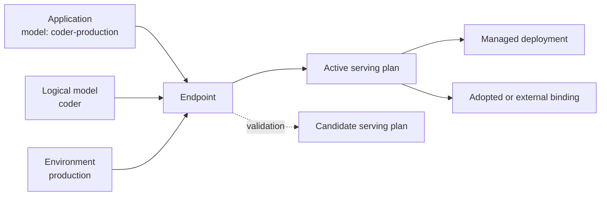

# One stable endpoint, replaceable serving plans

Applications call an **endpoint**. Everything behind it can evolve without changing the model name in
application code.

## The application layer

| Concept | Meaning | Example |
| --- | --- | --- |
| Logical model | Product-level identity independent of physical implementation | `coder` |
| Environment | Policy and isolation context | `development`, `staging`, `production` |
| Endpoint | Stable OpenAI-compatible name used by applications | `coder-production` |
| Serving plan | Immutable set of ordered backend bindings and routing policy | primary deployment plus bounded fallback |

An endpoint can have one active plan and one candidate plan. Promotion changes the plan behind the
stable endpoint; applications do not learn provider URLs or revision IDs.

## The lifecycle layer

| Concept | Meaning |
| --- | --- |
| DeploymentSpec | Desired model artifact, runtime, compute mode, capacity bounds, and routing policy |
| Deployment | A lifecycle-managed realization of a serving plan |
| Revision | Immutable snapshot created by an update |
| Replica intent | Durable claim that one external worker should exist |
| Operation | Leased, retryable state machine for create, update, scale, rollback, or delete |

Updates create a candidate revision beside the active revision. Release Guard evaluates persisted
readiness and request measurements before explicit promotion. A rejected candidate does not replace
the active revision.

Replica identity is deterministic, so retrying after a timeout or control-plane restart does not
create another provider resource for the same intent. CLI progress is a view of the durable operation;
closing the CLI does not cancel it.

## The evidence layer

- **ModelArtifact** resolves mutable model references to immutable repository commits where possible.
- **Request records** connect latency, tokens, retries, fallback, endpoint, plan, revision, and replica.
- **Release Guard evaluations** persist inputs, thresholds, decision, and reasons.
- **Inference Passports** sign bounded revision and evidence identity for offline verification.
- **Explanations** reproduce conclusions from persisted state and measurements; an LLM does not decide.

## The integration layer

Provider and runtime adapters implement narrow contracts. Registration means code is available;
qualification means an exact combination has passed a defined evidence gate. The distinction prevents
“adapter exists” from becoming an unsupported production claim.

<CardGroup cols={3}>
  <Card title="See the request path" icon="route" href="/architecture/system">
    Understand control-plane and data-plane ownership.
  </Card>
  <Card title="Create an endpoint" icon="link" href="/features/endpoints">
    Bind a logical model and environment to serving plans.
  </Card>
  <Card title="Read the lifecycle" icon="rotate" href="/features/lifecycle">
    Follow a durable operation from intent to convergence.
  </Card>
</CardGroup>

