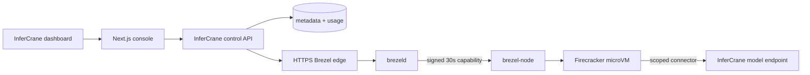

# Private computers backed by Brezel

Customers see an InferCrane **private computer**: a durable workspace that runs
commands safely, sleeps when idle, exposes short-lived previews, and can call an
approved InferCrane model endpoint. Brezel is the execution backend, not a
customer identity or browser dependency.

<Warning>
This remains a private-tenant CPU preview. Map one InferCrane tenant to one
dedicated Brezel project. The current host uses host-local workspace durability;
do not promise survival after complete host loss until encrypted backup and
restore or replicated storage is implemented and tested.
</Warning>



The browser never receives Brezel tokens, project credentials, engine IDs,
node capability tokens, internal addresses, workspace IDs, or provider sandbox
IDs. Every operation starts by resolving the customer-facing InferCrane ID and
checking its tenant ownership.

## Configure the provider

Create immutable Brezel environment and connector revisions first. Then mount a
dedicated owner-only service token and configure the stable mappings:

```bash
export INFERCRANE_BREZEL_SANDBOX_URL="https://sandbox.infercrane.com"
export INFERCRANE_BREZEL_SANDBOX_TOKEN_FILE="/run/secrets/brezel-sandbox-token"
export INFERCRANE_BREZEL_SANDBOX_PROJECT_ID="infercrane-private-computers"
export INFERCRANE_BREZEL_SANDBOX_TENANT_ID="tenant-enterprise-a"
export INFERCRANE_BREZEL_SANDBOX_DEFAULT_TEMPLATE="coding-agent"
export INFERCRANE_BREZEL_SANDBOX_TEMPLATES_JSON='{
  "coding-agent":"envr_964f832968870a80ca50570b",
  "evaluation-worker":"envr_82e4e61dd60afc96f4aff2a4"
}'
export INFERCRANE_BREZEL_SANDBOX_MODEL_CONNECTORS_JSON='{
  "<approved-infercrane-endpoint-id>":"connr_7cd6a14266f1d50ccc90c299"
}'
```

The token file must be a non-empty regular file readable only by its owner.
Production origins require HTTPS; loopback HTTP is accepted for local
development. None of these values may use a `NEXT_PUBLIC_` prefix.

For a model-enabled computer, Brezel injects only a short-lived connector
session:

```text
BREZEL_CONNECTOR_GATEWAY_URL=https://sandbox.infercrane.com/connector/v1/proxy
BREZEL_CONNECTOR_RENEW_URL=https://sandbox.infercrane.com/connector/v1/leases/renew
BREZEL_CONNECTOR_LEASE=<short-lived signed lease>
```

The client sends the lease to the gateway path for the immutable connector
revision selected by InferCrane. The gateway checks the live computer and route
policy before adding the real credential outside the guest. Long-lived
InferCrane, provider, GitHub, and cloud secrets must never enter guest
environment variables, command arguments, files, snapshots, receipts, or logs.

## Customer API

```text
GET    /api/v1/sandboxes/capabilities
GET    /api/v1/sandboxes
POST   /api/v1/sandboxes
GET    /api/v1/sandboxes/{id}
POST   /api/v1/sandboxes/{id}/commands
PUT    /api/v1/sandboxes/{id}/files?path=...
GET    /api/v1/sandboxes/{id}/files?path=...
POST   /api/v1/sandboxes/{id}/ports/{port}/leases
GET    /api/v1/sandboxes/{id}/events
GET    /api/v1/sandboxes/{id}/receipt
GET    /api/v1/sandboxes/usage
POST   /api/v1/sandboxes/{id}/pause
POST   /api/v1/sandboxes/{id}/resume
DELETE /api/v1/sandboxes/{id}
```

Create records InferCrane metadata first, creates a durable Brezel workspace,
attaches it at `/workspace`, then creates the computer from an approved
environment. Partial failure is compensated and remains visibly `failed` or
`cleanup_pending`; uncertainty is never rewritten as running.

```bash
curl -sS https://control.example.com/api/v1/sandboxes \
  -H "Authorization: Bearer $INFERCRANE_API_KEY" \
  -H "Idempotency-Key: computer-$(uuidgen)" \
  -H "Content-Type: application/json" \
  -d '{
    "display_name":"Evaluation run",
    "purpose":"evaluation",
    "source_type":"empty_workspace",
    "template_id":"evaluation-worker",
    "ttl_seconds":3600,
    "standby_after_seconds":900,
    "auto_resume":true,
    "network_mode":"offline"
  }'
```

Commands are bounded tasks, not an interactive PTY. The response stays an
incremental NDJSON stream: output chunks are base64-encoded and the terminal
`exited` event carries the exit code. Files are streamed with a 32 MiB limit.
Preview leases are re-brokered through an InferCrane-scoped URL; the original
provider path never reaches the browser.

## Usage and privacy

InferCrane maintains an append-only, idempotent usage ledger for running time,
standby time, command duration and exit class, transfer bytes, and preview
request counts. The dashboard calls this **usage**, not an invoice.

The ledger never records command text, stdout, stderr, file names or paths,
file contents, source code, prompts, model responses, preview URLs, or lease
tokens. Brezel Prometheus metrics remain operational metrics and are not the
customer billing ledger.

## Public edge and operations

Run the included Caddy edge with
`BREZEL_PUBLIC_HOST=sandbox.infercrane.com`. Only ports 80 and 443 are public;
restrict SSH to an operator network and never publish lifecycle, node,
database, Redis, or metrics ports. Cloud IAM used to administer the host is a
separate operational credential and must be rotated without changing the
dedicated Brezel service token used by InferCrane.

Verify the public `https://sandbox.infercrane.com/readyz` boundary. Query
`/v1/capabilities` through InferCrane with the dedicated service credential;
an unauthenticated request must return `401`. Then run the full lifecycle
through InferCrane: create, command, file write/read, HTTP preview, pause,
resume, persistence check, delete, and cleanup confirmation.

## Production qualification

The bounded Scaleway production tuple was qualified on 2026-09-21:

- Host: `brezel-benchmark` at `51.159.203.254`
- Public edge: `https://sandbox.infercrane.com` with active DNS and TLS
- Dedicated project: `infercrane-private-computers`
- Approved environments: `envr_964f832968870a80ca50570b` and
  `envr_82e4e61dd60afc96f4aff2a4`
- Model connector: `connr_7cd6a14266f1d50ccc90c299`

The production workflow passed creation, streamed commands, file persistence,
preview brokering, sanitized receipts, pause/resume, model connector access,
usage recording, deletion, and cleanup through InferCrane. The service token
remains host-side in an owner-only file and its value is not part of this
evidence. See [Scaleway Brezel evidence](/testing/scaleway-brezel-real-evidence)
for the exact qualification boundary.

## Current boundary

This release does not claim GPU passthrough, interactive PTY/SSH, arbitrary OCI
builds, public shared multitenancy, unrestricted internet with controlled egress,
or host-loss durability. Direct internet access stays disabled by default.

For E2B, Modal, Kubernetes, or another externally owned runtime, use
[external sandbox access](/integrations/sandboxes). Those routes bind scoped
model access but never mutate the external runtime.
