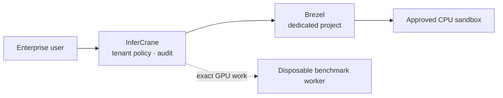

# Native sandboxes with Brezel

InferCrane can expose an approved subset of a dedicated Brezel project as the
**Sandboxes** product. InferCrane owns tenant authorization, allowed templates,
audit, and the stable customer API. Brezel owns the microVM lifecycle and guest
execution.

<Warning>
This is a private-tenant preview. Map one InferCrane tenant to one dedicated
Brezel project. Do not use one Brezel project as a shared hostile multi-tenant
service.
</Warning>



## Configure the provider

Create immutable Brezel environment revisions first. Then configure InferCrane
with an owner-only token file and a stable product-template mapping:

```bash
export INFERCRANE_BREZEL_SANDBOX_URL="https://brezel.internal.example"
export INFERCRANE_BREZEL_SANDBOX_TOKEN_FILE="/run/secrets/brezel-token"
export INFERCRANE_BREZEL_SANDBOX_PROJECT_ID="enterprise-a"
export INFERCRANE_BREZEL_SANDBOX_TENANT_ID="tenant-enterprise-a"
export INFERCRANE_BREZEL_SANDBOX_TEMPLATES_JSON='{
  "coding-agent":"envr_0123456789abcdef0123456789abcdef0123456789abcdef0123456789abcdef",
  "evaluation-worker":"envr_abcdef0123456789abcdef0123456789abcdef0123456789abcdef0123456789"
}'
export INFERCRANE_BREZEL_SANDBOX_DEFAULT_TEMPLATE="coding-agent"
```

The token file must be a non-empty regular file readable only by its owner.
Production Brezel origins require HTTPS; loopback HTTP is accepted for local
development. Configuration is all-or-nothing so a partial provider cannot
appear ready in the console.

## Customer lifecycle

```text
GET    /api/v1/sandboxes/capabilities
GET    /api/v1/sandboxes
POST   /api/v1/sandboxes
GET    /api/v1/sandboxes/{id}
POST   /api/v1/sandboxes/{id}/pause
POST   /api/v1/sandboxes/{id}/resume
DELETE /api/v1/sandboxes/{id}
```

Create accepts a product template, expiration, optional standby timing, and the
`offline` network mode. InferCrane resolves the product template to its pinned
Brezel environment revision. Lifecycle mutations require `Idempotency-Key` and
are recorded in the InferCrane tenant audit log.

```bash
curl -sS https://control.example.com/api/v1/sandboxes \
  -H "Authorization: Bearer $INFERCRANE_API_KEY" \
  -H "Idempotency-Key: sandbox-$(uuidgen)" \
  -H "Content-Type: application/json" \
  -d '{
    "template_id":"evaluation-worker",
    "ttl_seconds":3600,
    "network_mode":"offline"
  }'
```

InferCrane preserves Brezel's real `requested`, `preparing`, `running`,
`pausing`, `standby`, `resuming`, `deleting`, `deleted`, `expired`, `failed`,
and `unknown` states. It does not rewrite an uncertain provider state as ready.

## Current boundary

The first contract includes capability discovery and lifecycle management. It
does not claim GPU passthrough, PTY/SSH, arbitrary OCI builds, shared hosted
multitenancy, or hardware attestation. The dashboard labels completed command
output as task output rather than an interactive terminal.

Customer-facing sandboxes are also separate from InferCrane's internal
optimization workers. Internal workers accept only typed, digest-bound jobs and
a baked-in runner; exact GPU correctness and performance tests run through the
normal optimization campaign on separate workers.

For E2B, Modal, Kubernetes, or other externally owned sandboxes, use
[external sandbox access](/integrations/sandboxes) instead. Those routes issue
endpoint-scoped inference credentials but never mutate the external sandbox.
