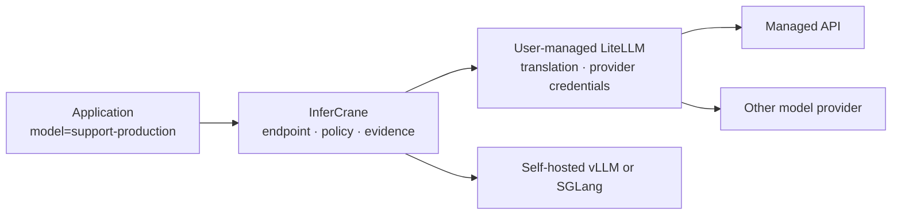

# Connect LiteLLM without replacing it

LiteLLM and InferCrane own different problems. LiteLLM translates provider protocols and holds its
upstream credentials. InferCrane owns the stable application endpoint, adoption state, persisted
request evidence, and safe release decisions.

<Info>
Before changing an application client, read the
[client compatibility contract](/features/protocols#client-compatibility-contract). It is the source
of truth for supported protocol surfaces, pass-through fields, InferCrane-interpreted fields,
streaming, cancellation, and client retry settings. A LiteLLM connection does not automatically
qualify every LiteLLM model, plugin, or OpenAI SDK behavior.
</Info>



## Connect in observe-only mode

```bash
infercrane connect https://litellm.internal.example/v1 \
  --as support-production \
  --type litellm \
  --model company-coder

infercrane observe support-production
infercrane doctor support-production
```

InferCrane verifies the OpenAI-compatible discovery surface before persisting the connection. It
does not install, configure, upgrade, or fork LiteLLM.

<Info>
The private console exposes the same path under **Create endpoint → Connect existing inference**. Choose
**LiteLLM** as the connector. Connections start observe-only; traffic ownership never transfers
silently.
</Info>

## Promote traffic ownership explicitly

After you have inspected health and evidence:

```bash
infercrane adopt promote support-production --ownership traffic-managed
```

The application continues calling:

<CodeGroup>
```python Python
from openai import OpenAI

client = OpenAI(
    base_url="https://inference.example.com/v1",
    api_key="INFERCRANE_ENDPOINT_TOKEN",
)

response = client.responses.create(
    model="support-production",
    input="Summarize this support case.",
)
```

```typescript TypeScript
import OpenAI from "openai";

const client = new OpenAI({
  baseURL: "https://inference.example.com/v1",
  apiKey: "INFERCRANE_ENDPOINT_TOKEN",
});

const response = await client.responses.create({
  model: "support-production",
  input: "Summarize this support case.",
});
```
</CodeGroup>

Use `max_retries=0` in Python and `maxRetries: 0` in TypeScript while qualifying the route. For a
stream, set `stream=True` or `stream: true` and consume the SDK's streaming iterator to completion;
InferCrane preserves SSE ordering and terminal `[DONE]`, never retries a partial stream, and records
the route under one request ID. Closing the client propagates cancellation best-effort, but whether
the exact LiteLLM/upstream pair stops compute or billing is real-environment evidence.

### Compatibility-safe client profile

SDKs differ in spelling, defaults, and retry behavior, but they all send the same HTTP contract.
Start with this deliberately small profile and expand it only after qualifying the exact LiteLLM
route. InferCrane does not publish a fictional SDK-by-SDK support claim for fields it merely passes
through.

| Concern | cURL | OpenAI Python | OpenAI TypeScript | Safe contract |
| --- | --- | --- | --- | --- |
| Base URL | `$INFERCRANE_URL/v1/...` | `base_url=.../v1` | `baseURL: .../v1` | InferCrane, not the LiteLLM worker URL |
| Stable identity | `"model":"support-production"` | `model="support-production"` | `model: "support-production"` | Same alias in every client; InferCrane rewrites only the selected upstream model |
| Automatic retries | `--retry 0` | `max_retries=0` | `maxRetries: 0` | Disabled during qualification; a partial stream is never replay-safe |
| Timeout | `--max-time 30` | `timeout=30.0` | `timeout: 30_000` | Client deadline is not proof that upstream compute or billing stopped |
| Buffered chat | JSON body without `stream` | `chat.completions.create(...)` | `chat.completions.create(...)` | Portable only after the route qualifies Chat Completions |
| Streaming chat | `curl -N`, `"stream":true` | `stream=True`; consume or close iterator | `stream: true`; `for await` or abort | Requires the route's streaming claim; preserve one request ID and never retry after a chunk |

The lowest-risk portable request contains only `model`, `messages`, and an application-bounded
`max_tokens`. Parameter compatibility is route-level, not client-library-level:

| Parameter or surface | InferCrane classification | Compatibility decision |
| --- | --- | --- |
| `model` | Required and interpreted | Supported as the stable InferCrane alias |
| `stream` | Interpreted capability gate | Rejected with `422 unsupported_protocol` when the selected binding does not claim streaming |
| `max_tokens` / `max_output_tokens` | Passed through and used by admission | Must remain within the endpoint admission policy and the upstream route's limit |
| `temperature`, `top_p`, `stop`, `seed` | Pass-through | Route-dependent; not an InferCrane portability guarantee |
| `tools`, `tool_choice`, `response_format` | Pass-through | Route-, model-, and template-dependent; qualify exact response shape |
| `logprobs` | Pass-through on Completions | Requires a Completions-capable route and upstream support |
| `encoding_format` | Pass-through on Embeddings | Requires an Embeddings-capable route and upstream support |
| Responses-only fields such as `reasoning` | Pass-through on Responses | Requires a Responses-capable route; the pinned default vLLM profile is not qualified |
| Unknown optional fields | Pass-through | Neither accepted nor rejected by InferCrane in advance; upstream acceptance is not portable evidence |
| Unsupported protocol path or streaming claim | Rejected before upstream transmission | `422 unsupported_protocol` with an OpenAI-compatible error body |
| Request over the gateway/admission byte limit | Rejected before upstream transmission | `413 request_too_large` |

This is the important boundary: InferCrane can enumerate the capability gates it owns, but it
cannot truthfully enumerate every rejected LiteLLM parameter without the exact LiteLLM version,
route, plugin, provider, and model. Record that matrix from staging qualification rather than
copying another route's result.

Use a binding known not to claim the requested capability to verify fail-closed behavior before
traffic migration:

```bash
curl --retry 0 -i -sS "$INFERCRANE_URL/v1/responses" \
  -H "Authorization: Bearer $INFERCRANE_API_KEY" \
  -H 'Content-Type: application/json' \
  -d '{"model":"CHAT_ONLY_STAGING_ALIAS","input":"compatibility probe"}'

# Expected before upstream transmission:
# HTTP/1.1 422 Unprocessable Entity
# ... "type":"unsupported_protocol" ...
```

If that request reaches LiteLLM, if the error schema changes, or if any pass-through field behaves
differently from the recorded staging fixture, keep traffic ownership unchanged and mark the route
unqualified.

| Request surface | Contract at the LiteLLM boundary |
| --- | --- |
| `model` | InferCrane interprets the stable endpoint alias, then selects the LiteLLM binding and rewrites only the upstream model identity. |
| `stream` | InferCrane validates the binding's streaming capability and otherwise preserves the value; partial streams are never retried. |
| `max_tokens` / `max_output_tokens` | Passed through and also interpreted for InferCrane admission limits. |
| Sampling, tools, structured output, unknown optional fields | Passed through; acceptance and semantics belong to the exact LiteLLM model/provider combination. |
| Chat Completions, Completions, Embeddings | Available only when both the InferCrane profile and exact LiteLLM route qualify the surface. |
| Responses and online batch | Gateway surfaces exist, but the pinned default vLLM profile is unqualified; qualify LiteLLM independently before use. |
| Unsupported protocol/capability | InferCrane returns `422 unsupported_protocol` before upstream transmission. |

The full [protocol matrix and cURL, Python, and TypeScript examples](/features/protocols#client-compatibility-contract)
also cover size limits, error schemas, tools, retries, and runtime-specific parameters.

## Ownership and qualification

| Concern | Owner |
|---|---|
| Provider API credentials | LiteLLM |
| Provider protocol translation | LiteLLM |
| LiteLLM install and upgrades | Your LiteLLM deployment |
| Stable application model name | InferCrane |
| Observe/route ownership state | InferCrane |
| Request Inspector and Doctor evidence | InferCrane |
| Release policy across serving plans | InferCrane |

The OpenAI-compatible behavior is locally qualified with hermetic fixtures. Real LiteLLM versions,
plugins, upstream providers, and credential policy still require qualification in your environment.

## Why not bundle LiteLLM?

Bundling would make InferCrane responsible for another gateway's security patches, license boundary,
provider catalog, and upgrades. The composition contract keeps that dependency replaceable and lets
teams use LiteLLM, another gateway, or InferCrane's native data plane without changing the logical
endpoint contract.

The open-source tree outside LiteLLM's separately identified enterprise area is MIT-licensed. The
decision not to fork is operational rather than merely legal: provider integrations and security
patches should continue arriving from their specialist owner. Any future managed-process adapter
must pin an exact upstream image, publish an SBOM, qualify its behavior, and remain replaceable.
