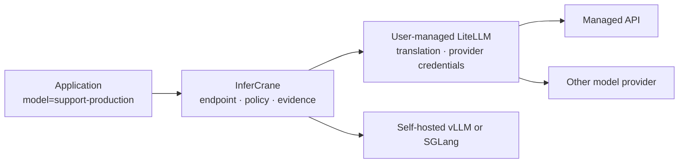

# Connect LiteLLM without replacing it

LiteLLM and InferCrane own different problems. LiteLLM translates provider protocols and holds its
upstream credentials. InferCrane owns the stable application endpoint, adoption state, persisted
request evidence, and safe release decisions.



## Connect in observe-only mode

```bash
infercrane connect https://litellm.internal.example/v1 \
  --as support-production \
  --type litellm \
  --model company-coder

infercrane observe support-production
infercrane doctor support-production
```

InferCrane verifies the OpenAI-compatible discovery surface before persisting the connection. It
does not install, configure, upgrade, or fork LiteLLM.

<Info>
The private console exposes the same path under **Create endpoint → Connect existing inference**. Choose
**LiteLLM** as the connector. Connections start observe-only; traffic ownership never transfers
silently.
</Info>

## Promote traffic ownership explicitly

After you have inspected health and evidence:

```bash
infercrane adopt promote support-production --ownership traffic-managed
```

The application continues calling:

<CodeGroup>
```python Python
from openai import OpenAI

client = OpenAI(
    base_url="https://inference.example.com/v1",
    api_key="INFERCRANE_ENDPOINT_TOKEN",
)

response = client.responses.create(
    model="support-production",
    input="Summarize this support case.",
)
```

```typescript TypeScript
import OpenAI from "openai";

const client = new OpenAI({
  baseURL: "https://inference.example.com/v1",
  apiKey: "INFERCRANE_ENDPOINT_TOKEN",
});

const response = await client.responses.create({
  model: "support-production",
  input: "Summarize this support case.",
});
```
</CodeGroup>

## Ownership and qualification

| Concern | Owner |
|---|---|
| Provider API credentials | LiteLLM |
| Provider protocol translation | LiteLLM |
| LiteLLM install and upgrades | Your LiteLLM deployment |
| Stable application model name | InferCrane |
| Observe/route ownership state | InferCrane |
| Request Inspector and Doctor evidence | InferCrane |
| Release policy across serving plans | InferCrane |

The OpenAI-compatible behavior is locally qualified with hermetic fixtures. Real LiteLLM versions,
plugins, upstream providers, and credential policy still require qualification in your environment.

## Why not bundle LiteLLM?

Bundling would make InferCrane responsible for another gateway's security patches, license boundary,
provider catalog, and upgrades. The composition contract keeps that dependency replaceable and lets
teams use LiteLLM, another gateway, or InferCrane's native data plane without changing the logical
endpoint contract.

The open-source tree outside LiteLLM's separately identified enterprise area is MIT-licensed. The
decision not to fork is operational rather than merely legal: provider integrations and security
patches should continue arriving from their specialist owner. Any future managed-process adapter
must pin an exact upstream image, publish an SBOM, qualify its behavior, and remain replaceable.
