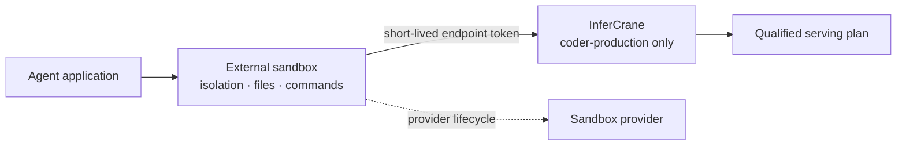

# Least-privilege inference for an agent sandbox

Keep tool execution in E2B, Modal, Kubernetes, or another sandbox specialist. InferCrane records only
the external sandbox identity and issues an expiring inference credential restricted to one stable
endpoint.



## Issue access

Create the sandbox with its native API or control plane first. Then connect its external identity:

```bash
infercrane sandbox connect \
  --provider e2b \
  --external-id sandbox-01JCGW \
  --external-revision template-v3 \
  --endpoint coder-production \
  --ttl 30m
```

The command prints the credential once. Inject it using the sandbox provider's secret mechanism:

```bash
export INFERCRANE_URL="https://inference.example.com"
export INFERCRANE_API_KEY="ic_...shown-once..."
```

Inside the sandbox, use an ordinary OpenAI client:

```python
import os
from openai import OpenAI

client = OpenAI(
    base_url=os.environ["INFERCRANE_URL"].rstrip("/") + "/v1",
    api_key=os.environ["INFERCRANE_API_KEY"],
)

result = client.responses.create(
    model="coder-production",
    input="Explain the failing test without modifying files.",
)
print(result.output_text)
```

That token cannot enumerate or invoke a different endpoint alias, and it cannot call the InferCrane
control API.

## Inspect, rotate, and revoke

```bash
infercrane sandbox list
infercrane sandbox rotate SANDBOX_REFERENCE_ID
infercrane sandbox revoke SANDBOX_REFERENCE_ID --yes
```

Rotation invalidates the previous credential. Revocation disables InferCrane access but does not
delete, pause, snapshot, or mutate the external sandbox.

The issuing control-plane instance refreshes its database-independent credential snapshot before it
returns. In a horizontally scaled control plane, other gateway replicas converge on the persisted
change on their bounded credential refresh interval (one second by default). Keep a retry for an
initial `401` from a newly issued credential. Rotation and revocation may take that same bounded
interval to reach every replica.

<Warning>
InferCrane does not provide sandbox isolation and never stores sandbox commands, files, prompts,
outputs, or provider credentials. Configure network policy, filesystem access, resource limits, and
secret injection in the sandbox system that owns execution.
</Warning>

## Console workflow

Open **Settings → Gateways, sandboxes, and training**. The console can issue, rotate, and revoke the
same scoped credentials through the authenticated control API. Credentials are revealed only in the
mutation response and are never persisted in browser-accessible storage.

## Local proof and real-system qualification

Local black-box acceptance proves endpoint restriction, old-token invalidation, revocation, and the
external-resource ownership boundary. It cannot prove a third-party sandbox's isolation, secret
injection, network policy, or lifecycle semantics; qualify those with the chosen provider.
