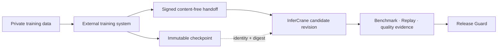

# Bring trained artifacts into the release path

InferCrane does not schedule training jobs. MLflow, Kubeflow, SkyPilot, a managed fine-tuning system,
or your existing pipeline owns data, execution, and checkpoint storage. The pipeline hands InferCrane
a signed immutable artifact identity for release qualification.



## Create a signing key

Keep this key in the training system's secret manager:

```bash
infercrane training keygen --file training-handoff.key
```

The private key file is created with mode `0600` and is never uploaded to InferCrane.

## Sign immutable provenance

```bash
infercrane training sign coder-runtime REVISION_ID \
  --provider mlflow \
  --run run-2026-08-14-42 \
  --repository mlflow://registry/coder/42 \
  --immutable-revision 42 \
  --digest sha256:aaaaaaaaaaaaaaaaaaaaaaaaaaaaaaaaaaaaaaaaaaaaaaaaaaaaaaaaaaaaaaaa \
  --base-model meta-llama/Llama-3.1-8B-Instruct@IMMUTABLE_COMMIT \
  --method lora \
  --framework transformers \
  --framework-version 5.0.0 \
  --key training-handoff.key \
  --file coder-42.handoff.json
```

Use the checkpoint digest produced by your registry or artifact store. The handoff contains no
dataset rows, prompts, outputs, logs, credentials, or checkpoint bytes.

## Verify and attach

```bash
infercrane training verify coder-42.handoff.json
infercrane training attach coder-runtime coder-42.handoff.json
infercrane training list coder-runtime
```

Attachment fails closed when:

- the signature or payload was modified;
- the path deployment does not match the signed deployment;
- the revision belongs to another tenant or does not exist;
- the revision already references a different immutable artifact;
- the repository contains credentials, query parameters, or a mutable/unsafe location.

## Promotion remains separate

Artifact provenance is not evidence that a candidate should receive traffic. Continue with:

```bash
infercrane benchmark coder-runtime
infercrane replay coder-runtime --candidate REVISION_ID
infercrane evaluation attach coder-runtime --file quality-evidence.json
infercrane rollout inspect coder-runtime
```

Release Guard decides from compatible persisted policy and evidence. An external training system
never promotes a revision by merely attaching a checkpoint.

## Console workflow

Workload detail displays signed training lineage and accepts an already signed handoff JSON file.
Signing remains a CLI/CI operation so private training keys never enter browser code.
