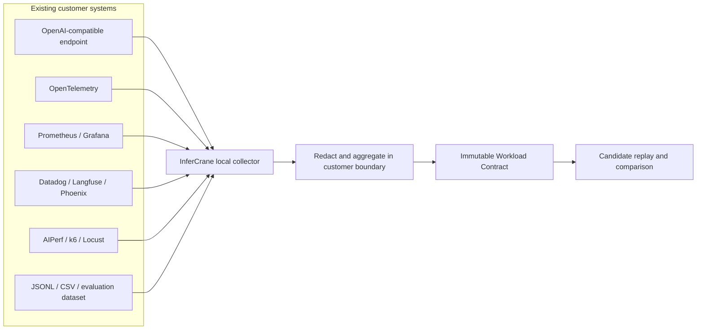
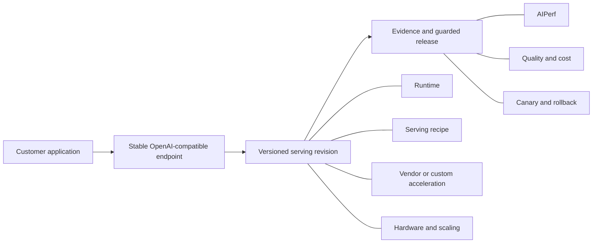

# InferCrane Workload Optimizer MVP

This brief accompanies `workload-optimizer-mvp.html`. It is a proposed product
slice, not a statement that every integration shown in the prototype is already
implemented.

## Product in one sentence

Connect a real inference workload and its constraints; InferCrane searches the
serving stack, spends a bounded GPU budget, proves the winning configuration,
and returns a deployable recipe behind a stable endpoint.

## Initial customer

An enterprise ML or platform team that:

- already has an open-weight model or compatible inference endpoint;
- has real traffic, a representative trace, or a task evaluation set;
- spends enough on inference for a measured improvement to matter;
- cannot accept generic benchmark claims or send production content to a third
  party; and
- wants a reproducible answer rather than a consulting recommendation.

The first engagement should optimize one model and one workload on one target
hardware family. Cross-model substitution is a later search dimension because
it materially expands the quality-evaluation problem.

## Customer flow

The dashboard stays deliberately small: **Models, Deployments, Sandboxes,
Usage, and API keys**. Models contains two delivery tabs: **Use via API** and
**Deploy open-weight**. Dedicated deployment is **choose a model → answer four
questions → review the plan → deploy**.
The deployment assistant asks one question at a time:

1. **Workload** — interactive, agents and coding, structured decisions, batch,
   or a custom description.
2. **Objective** — balanced, faster responses, lower cost, or more throughput.
3. **Destination** — InferCrane managed, customer cloud/Kubernetes, an existing
   inference provider, or plan only.
4. **Evidence** — no workload yet, a live endpoint, telemetry, local AIPerf, or
   an approved trace/evaluation dataset.

Review is not a fifth question. It confirms the boundary and shows the starting
runtime, recipe, acceleration, hardware, evidence, and release plan.

## MVP surface map

| Surface | Customer job | Primary action | What stays hidden |
|---|---|---|---|
| Models | Use a hosted API or choose an open-weight deployment | Create key / deploy | Supplier routing, runtime, GPU, and kernel search |
| Deployments | See serving models | Open deployment | Candidate and operation internals |
| Deployment detail | Integrate, observe, improve | Copy API / improve | Campaign machinery until requested |
| Sandboxes | Run code or evaluations privately | Create sandbox | Internal optimization sandboxes |
| Usage | Understand traffic, latency, and spend | Change time or endpoint | Low-level telemetry dimensions |
| API keys | Create and revoke access | Create key | Secret material after first display |

Only two dialogs belong in the MVP:

- **New** offers four starts: use a model via API, deploy open-weight, connect
  existing inference, or create a sandbox. Optimization starts inside a
  deployment.
- **Advanced deployment settings** optionally accepts concurrency, TTFT,
  minimum warm capacity, and a spend limit. Runtime, GPU, quantization, cache,
  parallelism, and kernels remain outputs.

Sandbox creation is a focused page because approved template and expiration
need review together. Networking remains off in the first private-tenant
preview. Workload connection is inline in the deployment assistant so users
understand the selected data boundary before continuing.

Technical choices are outputs, not form fields. The customer defines intent,
constraints, and the infrastructure/data boundary. InferCrane determines the
runtime, precision, cache, scheduler, hardware, scaling, and whether a
profile-backed kernel experiment is justified. Optimization appears as
**Improve** inside an existing deployment rather than as a separate product
area.

The first deployment is a **best safe starting combination**, not an
unqualified claim of globally best performance. InferCrane ranks reviewed,
compatible configurations against the declared workload objective, deploys the
selected baseline with explicit evidence boundaries, and then learns from real
traffic.

1. **Profile** — connect an existing OpenAI-compatible endpoint, run AIPerf
   locally or in-cluster, or upload a redacted trace. Freeze an immutable
   workload/SLO contract.
2. **Search** — generate runtime, scheduler, cache, quantization, speculative,
   backend, hardware, and profile-gated kernel candidates. Reject incompatible
   combinations without allocating a GPU.
3. **Build** — run the planner and generated-code tools in a Brezel microVM
   sandbox. Produce pinned experiment manifests and signed lifecycle receipts.
4. **Measure** — send only the small eligible set to explicit, budget-leased GPU
   workers in customer infrastructure or a supported provider.
5. **Prove** — compare candidates on the same workload digest; enforce task
   quality, API correctness, reliability, TTFT/ITL, goodput, cost, and
   successful-fraction gates.
6. **Deploy** — return an immutable serving recipe, container or provider plan,
   Release Guard decision, and optional candidate revision behind the stable
   InferCrane endpoint.

The customer's input is the workload and desired outcome. The primary output is
the measured delta and reproducible recipe, not a page of infrastructure knobs.

Kernel search is existing-first: pinned runtime implementation → FlashInfer or
CUTLASS/CuTe → adapted Triton/CuTe → handwritten CUDA last. The dashboard shows
which sources were inspected, selected, or rejected. “Custom kernel” is never a
default checkbox or guaranteed deliverable.

## Workload integration

InferCrane must integrate with the systems customers already operate rather
than replace their observability stack. OpenTelemetry is the canonical trace
shape, Prometheus is the canonical metrics shape, and an OpenAI-compatible
endpoint is the canonical inference interface. Vendor connectors translate
into the same internal contract.

The Workload Contract records distributions rather than a single average:

- input/output token lengths, request rate, concurrency, streaming, tool use,
  and cacheability;
- TTFT, ITL, goodput, reliability, quality, and budget constraints;
- target environment, hardware restrictions, region, and scaling boundary;
- the evaluation command, dataset, rubric, or manual-promotion policy; and
- data policy: metadata only, redacted traces, in-cluster execution, or
  explicitly approved examples.

Metadata-only is the default. Raw prompts and outputs do not leave the customer
environment unless the customer explicitly approves them.

## What the customer receives

The deployment review should describe a concrete product output, not merely a
cloud resource:

The versioned serving revision contains:

- exact model identity and stable endpoint contract;
- runtime and pinned container or provider plan;
- precision, batching, cache, scheduler, and parallelism recipe;
- GPU family, region, replica topology, and autoscaling plan;
- vendor libraries and kernels, with custom kernels only when profiling shows
  material end-to-end value; and
- evidence bundle, Release Guard decision, canary policy, and rollback point.

A custom kernel is therefore a conditional search dimension, not a default
deliverable. A valid result can explicitly state that the vendor kernel won and
the custom path was rejected.

## System responsibilities

### InferCrane control plane

- workload identity and SLO contract;
- campaign, candidate, budget, lease, and evidence state;
- exact-tuple qualification and experiment memory;
- stable endpoints, revisions, Release Guard, audit, and billing;
- measured-versus-modeled-versus-unknown presentation.

### FastPath optimization engine

- capability discovery and candidate generation;
- local compatibility, memory, integrity, and prior-evidence filtering;
- comparable AIPerf run processing;
- hard qualification, Pareto filtering, policy ranking, and recipe freezing;
- profiler-gated kernel opportunity and optimization-compiler interface;
- preservation of rejected experiments and their causes.

### Brezel experiment sandbox

- isolated agent/planner execution;
- private trace analysis and candidate-code generation;
- configuration validation, compilation, report generation, and artifact
  inspection;
- disposable compute and signed lifecycle receipt; durable workspaces remain a
  later customer-sandbox capability after the native path is qualified;
- deny-by-default networking and narrow model/tool connectors.

Brezel does not currently provide GPU passthrough. It is the safe optimization
workspace in this MVP, not the target GPU executor.

`internal/brezelexecutor` now implements this boundary. It submits a typed,
content-addressed manifest to a pinned Brezel environment, invokes only a fixed
runner, validates typed artifact evidence, deletes the sandbox, and returns the
lifecycle receipt. Customer-facing sandboxes use the same separately deployed
Brezel service, but their resources never appear as optimization campaign
workers in the UI.

### GPU worker

- immutable model/runtime materialization;
- AIPerf workload execution and server/GPU telemetry;
- Nsight profiling when the campaign policy authorizes it;
- correctness and task-quality execution;
- result upload and guaranteed teardown on completion, failure, or lease expiry.

The MVP can begin with one worker adapter, such as Modal, RunPod, or a customer
Kubernetes job. It does not need an InferCrane-owned GPU fleet.

## How the MVP controls GPU cost

Use a multi-fidelity funnel:

1. **Free planning:** model metadata, runtime capabilities, memory bounds,
   known incompatibilities, historical rejections, and existing evidence.
2. **Cheap screening:** short deterministic correctness checks and limited
   workload lanes on the target GPU.
3. **Qualification:** only the Pareto candidates receive repeated trace replay,
   full quality gates, server metrics, and landed-cost accounting.
4. **Profiling:** Nsight is reserved for a qualified winner with a material
   end-to-end bottleneck.
5. **Kernel generation:** only a profiler-backed opportunity above the policy's
   materiality threshold enters the generate/compile/verify/benchmark loop.

Every campaign has a hard money ceiling, maximum lease duration, and automatic
teardown. Experiment memory prevents paying to rediscover the same failure for
the same model/runtime/hardware/workload tuple.

## MVP scope

The first sellable version needs:

- one workload intake path for a compatible endpoint;
- OTLP ingestion and a read-only Prometheus connection;
- one local/in-cluster AIPerf runner and one redacted JSONL/CSV import path;
- metadata-only, redacted, and in-cluster data-boundary policies;
- vLLM and SGLang candidate generation for a curated model family;
- one target GPU family and one paid/BYOC worker adapter;
- configurable TTFT, ITL, goodput, reliability, and budget constraints;
- API correctness plus customer-supplied task evaluation;
- FastPath comparison, selection, recipe, and rejection memory;
- a Brezel-backed planner job with an inspectable receipt;
- a customer-readable proof report;
- recipe export and manual, guarded candidate deployment.

## Explicit non-goals

- an InferCrane-owned multi-region GPU cloud;
- automatic optimization of every model, accelerator, and runtime;
- autonomous production traffic changes;
- claiming a kernel win from a microbenchmark alone;
- making generated kernels part of every campaign;
- Brezel GPU passthrough or hostile shared-multitenant claims;
- replacing the customer's observability stack;
- cross-model replacement without a customer-approved quality contract.

## VC demo

The strongest demo is one reproducible before/after workload:

1. connect or select the Qwen reference workload;
2. show 34 candidate recipes generated and 25 eliminated locally;
3. open the Brezel planner receipt and exact experiment plan;
4. show the bounded AIPerf runs and preserved rejections;
5. reveal the measured FastPath snapshot: SGLang control versus native MTP K4;
6. show the Release Guard decision and immutable recipe;
7. prepare a dry-run deployment without moving traffic.

For the current PoC snapshot, the selected candidate reports approximately 58%
lower mean cost per successful million output tokens and 88% higher mean
SLO-qualified output goodput than the SGLang control across the declared c1/c4/c8
workload. The claim must remain bound to that exact model, revision, runtime,
H100 environment, workload digest, screening evidence level, and retained raw
evidence.

## Why this can compound

The product does not only learn which candidate won. It retains:

- workload shapes and SLO contracts without customer content;
- exact compatibility and failure reasons;
- measurements by model, runtime, accelerator, and serving phase;
- profiler-backed bottleneck and kernel-opportunity records;
- accepted recipes, rejected paths, and post-deployment behavior.

That experiment memory becomes the economic moat: each campaign improves the
prior for the next campaign and reduces the number of paid GPU trials required.
The control plane, isolated execution layer, and evidence graph are therefore
part of the optimization product—not supporting infrastructure around it.
