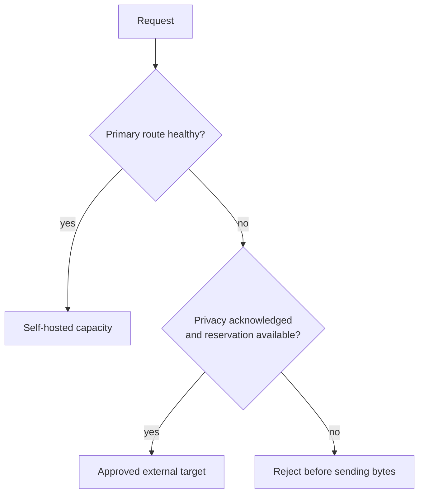

# A slow provider operation should not own your terminal

Cloud deployment is submitted as one durable operation. The operation worker—not the CLI process—owns
provider mutation, retries, and reconciliation.

```bash
infercrane deploy Qwen/Qwen3-8B \
  --cloud runpod \
  --gpu L40S \
  --min 1 \
  --max 4
```

The command reports the durable operation ID before waiting. You may close the terminal and resume
from another session without sending another provider create request:

```bash
infercrane operation watch op_01JEXAMPLE \
  --wait-timeout 15m
```

Idempotency, provider-resource identity, leased execution, and reconciliation protect the operation
across CLI disconnects and control-plane worker restarts. They cannot make unavailable GPU capacity
appear faster, but they prevent waiting from becoming an unsafe client-side workflow.

## Explain what the backend actually exposed

```bash
infercrane explain cold-start qwen-prod
infercrane explain cold-start qwen-prod --output json
```

Cold-start explanations label observed and unavailable timing boundaries independently. A provider
that exposes only zero-worker state and gateway time to first response byte does not produce a
fabricated artifact-download or model-load waterfall.

## Compare measured serving plans

Use AIPerf once per real deployment, then compare compatible persisted results:

```bash
infercrane benchmark qwen-l40s --requests 100 --concurrency 10
infercrane benchmark qwen-h100 --requests 100 --concurrency 10

infercrane lab 'Qwen/Qwen3-8B@IMMUTABLE_COMMIT' \
  --max-ttft-p95-ms 250
```

Inference Lab currently emits `MEASURED` candidates from benchmark history. It does not silently
provision hardware, estimate missing performance, or mix incompatible workloads. Cost is shown only
when a trustworthy source and observation timestamp were persisted.

## Add governed external overflow

When every ordinary target is unhealthy—or a bounded queue policy remains breached—InferCrane can
select an explicitly configured external target:

```bash
infercrane external configure qwen-prod \
  --target openrouter-qwen \
  --adapter openrouter \
  --secret-reference SECRET_REFERENCE_ID \
  --request-limit 100 \
  --cost-limit-usd 10.00 \
  --max-request-cost-usd 0.10 \
  --acknowledge-external-data \
  --enable
```



<Warning>
External fallback can transmit prompts and generated output outside infrastructure you control and
can create a separate provider charge. InferCrane requires explicit acknowledgement and hard request
and worst-case cost reservations. It never fabricates a provider price or silently retries a request
after a possible send.
</Warning>

This is a safety valve, not automatic provider shopping. Selection, denial, recovery, budget counters,
and the signal snapshot remain available as persisted evidence.

