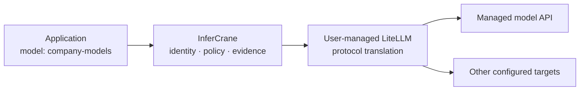

# Useful in minutes, without a migration

Connect an existing endpoint in observe-only mode. InferCrane performs bounded discovery and records
the result without publishing a route or taking provider ownership.

<CodeGroup>
```bash Automatic discovery
infercrane connect https://vllm.internal.example/v1 \
  --as coder-production
```

```bash Explicit vLLM
infercrane connect https://vllm.internal.example/v1 \
  --as coder-production \
  --type vllm
```

```bash Machine-readable
infercrane connect https://vllm.internal.example/v1 \
  --as coder-production \
  --output json
```
</CodeGroup>

When discovery cannot determine a physical model safely, provide it explicitly:

```bash
infercrane connect https://gateway.internal.example/v1 \
  --as coder-production \
  --type openai-compatible \
  --model Qwen/Qwen3-32B
```

`connect` is intentionally conservative. Runtime detection is reported only when the endpoint
provides grounded signals. Unknown capability remains unknown rather than being inferred from a URL.

## Turn evidence into a daily workflow

```bash
infercrane doctor coder-production --window 1h
infercrane request inspect req_fa098a6488ec2bedcf025844adda5f45
```

Doctor evaluates persisted `Evidence → Rule → Finding` logic. Request Inspector reconstructs the
logical endpoint, resolved target, revision or upstream where known, queue and response timing,
tokens, retry count, and fallback reason. Prompt and output content are not recorded by default.

After reviewing health and evidence, transfer routing ownership explicitly:

```bash
infercrane adopt promote coder-production --ownership traffic-managed
```

The workload remains externally managed: InferCrane does not create, scale, update, or delete it.

## Use a user-managed LiteLLM gateway

LiteLLM can sit behind InferCrane as an optional external OpenAI-compatible gateway:

```bash
infercrane connect https://litellm.internal.example/v1 \
  --as company-models \
  --type litellm \
  --model coder
```



InferCrane does not bundle, fork, install, or license LiteLLM. The operator supplies and manages the
gateway and its provider credentials. This keeps the core integration generic: the same connection
path works with another compatible gateway when it passes discovery and health checks.

<Warning>
Connecting an endpoint does not prove every protocol or model behavior. Qualify streaming, tool calls,
structured output, cancellation, and model identity for the exact upstream before production traffic.
The current simple discovery path requires the control plane to read `/v1/models` without an
upstream credential. Keep authenticated gateways externally configured until a reference-only
upstream credential binding is qualified; never place credentials in the endpoint URL.
</Warning>

## Why this pattern matters

- **Platform teams** can observe one workload before adopting a fleet.
- **vLLM operators** can retain their existing compute and container setup.
- **LiteLLM users** can retain broad managed-provider translation while InferCrane owns durable
  operational evidence and logical endpoint identity.
- **Migration-sensitive teams** can progress from observe-only to traffic-managed ownership without
  transferring provider lifecycle.
