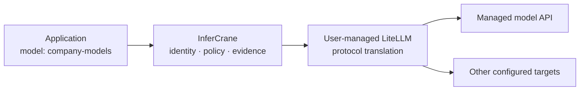

# Useful in minutes, without a migration


The recording is generated from `scripts/demo-connect.sh` in the private-preview repository against
GPU-free local fixtures. It proves the product workflow, not real-runtime performance.

Connect an existing endpoint in observe-only mode. InferCrane performs bounded discovery and records
the result without publishing a route or taking provider ownership.

<CodeGroup>
```bash Automatic discovery
infercrane connect https://vllm.internal.example/v1 \
  --as coder-production
```

```bash Explicit vLLM
infercrane connect https://vllm.internal.example/v1 \
  --as coder-production \
  --type vllm
```

```bash Machine-readable
infercrane connect https://vllm.internal.example/v1 \
  --as coder-production \
  --output json
```
</CodeGroup>

When discovery cannot determine a physical model safely, provide it explicitly:

```bash
infercrane connect https://gateway.internal.example/v1 \
  --as coder-production \
  --type openai-compatible \
  --model Qwen/Qwen3-32B
```

`connect` is intentionally conservative. Runtime detection is reported only when the endpoint
provides grounded signals. Unknown capability remains unknown rather than being inferred from a URL.

## Qualify before routing traffic

Observe-only discovery does not prove optional runtime behavior. Before changing application code or
promoting routing ownership:

```bash
infercrane integrations --output json
infercrane doctor coder-production --window 1h
infercrane observe coder-production --output json
```

Confirm the discovered physical model and runtime, then exercise every protocol the application
depends on directly against an isolated upstream or staging route. The
[protocol qualification procedure](/features/protocols#qualify-tool-calling-and-streaming) covers
buffered tool calls, SSE completion, request attribution, and the evidence identity to record.
Structured output, cancellation, embeddings, and other model-dependent surfaces require their own
fixtures. If any required capability remains `unknown` or unqualified, retain observe-only ownership.

## Compare the existing and managed request paths

Use the same non-sensitive fixture first against the current upstream, then through InferCrane. The
application remains on its existing URL during this comparison.

```bash
# Existing provider-owned path: use its physical model name.
curl -N -D direct.headers -o direct.sse \
  "$UPSTREAM_URL/v1/chat/completions" \
  -H "Authorization: Bearer $UPSTREAM_API_KEY" \
  -H 'Content-Type: application/json' \
  -d '{
    "model":"Qwen/Qwen3-32B",
    "messages":[{"role":"user","content":"Return the word ready."}],
    "stream":true
  }'

infercrane doctor coder-production --window 1h
infercrane observe coder-production --output json
```

Before routing ownership changes, the direct response must prove model identity, status/error
shape, content type, expected chunks, and terminal `data: [DONE]`. Record direct latency and TTFT
outside InferCrane; observe-only mode does not proxy the request and cannot attribute that direct
call to a managed request record.

### Approve cost and ownership before migration

Observe-only connection creates no provider capacity and sends no application traffic, but the
existing workload continues to incur whatever infrastructure cost its owner already pays.
InferCrane does not import that provider bill automatically. Before approving client migration,
record one comparable window:

| Decision input | Required evidence |
| --- | --- |
| Existing compute cost | Provider invoice/export or exact OpenCost allocation, currency, coverage window, and owning team |
| Managed-path behavior | Same request shape/window, request count and tokens, latency/TTFT/errors, stable endpoint and selected binding |
| Ownership | `traffic-managed` changes routing only; the existing team retains create/scale/update/delete and provider incident response |
| Privacy | Prompt/output content is not recorded by default; the upstream still receives it under its existing data policy |
| External fallback | Separate explicit consent plus immutable request and worst-case cost reservations before it can receive traffic |

Use [Cost and performance](/showcase/cost-performance) for comparable evidence. Unknown price,
currency, coverage, provider identity, or data policy remains `unavailable`. The approver must be the
team accountable for provider spend and data handling; InferCrane does not turn missing cost into a
savings estimate. Keep clients on the original URL and retain observe-only ownership until those
inputs and the direct-versus-managed compatibility check pass.

<Warning>
`adopt promote --ownership traffic-managed` changes who may route application traffic. Perform the
checks above first. Promotion does not make an unqualified upstream safe, does not transfer create,
scale, update, or delete ownership, and does not authorize sensitive fixture data. Keep the existing
client path available until compatibility is proven.
</Warning>

```bash
infercrane adopt promote coder-production --ownership traffic-managed

curl -N -D managed.headers -o managed.sse \
  "$INFERCRANE_URL/v1/chat/completions" \
  -H "Authorization: Bearer $INFERCRANE_API_KEY" \
  -H 'Content-Type: application/json' \
  -d '{
    "model":"coder-production",
    "messages":[{"role":"user","content":"Return the word ready."}],
    "stream":true
  }'
```

Compare schema, status/error behavior, SSE ordering and `[DONE]`, then inspect the managed
`X-Request-Id`. To test a delayed provider, inject a bounded delay only in a staging upstream you
control and repeat both paths; compare direct elapsed time with InferCrane `queue_ms`, `ttft_ms`, and
`latency_ms`. A provider-hidden delay remains combined upstream time, not a fabricated allocation or
model-load boundary.

Stop and keep application clients on the original URL if the managed path changes a required
protocol, model identity, cancellation behavior, or error contract; if evidence is missing; or if
the delayed request exceeds the approved timeout. Traffic-managed ownership is not lifecycle
ownership, so provider recovery still occurs in the existing owning system.

## Turn evidence into a daily workflow

```bash
infercrane doctor coder-production --window 1h
infercrane request inspect req_fa098a6488ec2bedcf025844adda5f45
```

Doctor evaluates persisted `Evidence → Rule → Finding` logic. Request Inspector reconstructs the
logical endpoint, resolved target, revision or upstream where known, queue and response timing,
tokens, retry count, and fallback reason. Prompt and output content are not recorded by default.

After this comparison passes, applications may move to the stable InferCrane endpoint. The workload
remains externally managed: InferCrane does not create, scale, update, or delete it.

## Use a user-managed LiteLLM gateway

LiteLLM can sit behind InferCrane as an optional external OpenAI-compatible gateway:

```bash
infercrane connect https://litellm.internal.example/v1 \
  --as company-models \
  --type litellm \
  --model coder
```



InferCrane does not bundle, fork, install, or license LiteLLM. The operator supplies and manages the
gateway and its provider credentials. This keeps the core integration generic: the same connection
path works with another compatible gateway when it passes discovery and health checks.

<Warning>
Connecting an endpoint does not prove every protocol or model behavior. Qualify streaming, tool calls,
structured output, cancellation, and model identity for the exact upstream before production traffic.
The current simple discovery path requires the control plane to read `/v1/models` without an
upstream credential. Keep authenticated gateways externally configured until a reference-only
upstream credential binding is qualified; never place credentials in the endpoint URL.
</Warning>

## Why this pattern matters

- **Platform teams** can observe one workload before adopting a fleet.
- **vLLM operators** can retain their existing compute and container setup.
- **LiteLLM users** can retain broad managed-provider translation while InferCrane owns durable
  operational evidence and logical endpoint identity.
- **Migration-sensitive teams** can progress from observe-only to traffic-managed ownership without
  transferring provider lifecycle.
