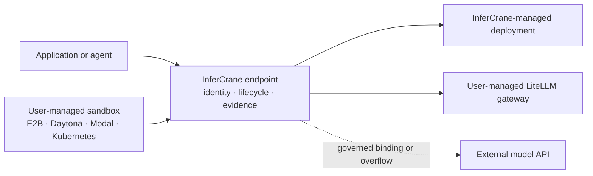

# Use the right owner for each layer

InferCrane does not need to replace every component in an inference or agent stack. It provides the
stable model endpoint, durable lifecycle, routing policy, and operational evidence. A user-managed
gateway can translate provider protocols, and a sandbox can execute agent tools while calling that
endpoint like any other application.



## Connect a user-managed LiteLLM gateway

Keep LiteLLM's provider configuration and credentials in LiteLLM. Connect its OpenAI-compatible
surface to InferCrane in observe-only mode first:

```bash
infercrane connect https://litellm.internal.example/v1 \
  --as company-models \
  --type litellm \
  --model coder

infercrane doctor company-models
```

After qualification, transfer routing ownership explicitly:

```bash
infercrane adopt promote company-models --ownership traffic-managed
```

InferCrane does not bundle, fork, install, or license LiteLLM. It owns the logical endpoint and
operational evidence; LiteLLM remains responsible for protocol translation and its upstreams.

## Add managed APIs without changing application code

An authenticated OpenRouter or OpenAI-compatible API can be a first-class endpoint binding. Stage
it as a fallback while the application continues sending `model="coder-production"`:

```bash
infercrane endpoint bind coder-production \
  --name managed-fallback \
  --target managed-coder \
  --ownership traffic-managed \
  --external-adapter openai-compatible-external \
  --secret-reference SECRET_REFERENCE_ID \
  --request-limit 1000 \
  --cost-limit-usd 25.00 \
  --max-request-cost-usd 0.10 \
  --acknowledge-external-data \
  --enable-external

infercrane endpoint plan coder-production \
  --policy primary-fallback \
  --bindings self-hosted,managed-fallback
```

The plan remains a candidate until evaluated and promoted. InferCrane never forwards its public API
key to the provider and never stores the provider key in binding configuration.

## Use OpenRouter as deployment overflow

OpenRouter can also be optional deployment-level emergency capacity, not an implicit default. Configure it with a
secret reference, explicit model mapping, privacy acknowledgement, and hard request and cost
reservation ceilings. InferCrane selects it before sending bytes and never silently duplicates or
shadows a request.

```bash
export OPENROUTER_API_KEY='...'
infercrane secret create openrouter --from-env OPENROUTER_API_KEY --output json

infercrane target add openrouter-qwen \
  --provider openrouter \
  --url https://openrouter.ai/api/v1 \
  --upstream-model qwen/qwen3-8b
```

Complete the bounded policy using [Governed external capacity](/features/external-capacity). Real
OpenRouter billing qualification is still deferred; InferCrane does not fabricate price evidence.

## Call InferCrane from an agent sandbox

The sandbox is the application execution environment. Create it with the sandbox provider, then
issue a short-lived credential restricted to exactly one InferCrane endpoint:

```bash
infercrane sandbox connect \
  --provider e2b \
  --external-id sandbox-01JCGW \
  --external-revision template-v3 \
  --endpoint coder-production \
  --ttl 30m
```

Inject the shown-once credential through the sandbox provider's secret mechanism, then use an
ordinary OpenAI client inside the sandbox:

<CodeGroup>
```python Python
import os
from openai import OpenAI

client = OpenAI(
    base_url=os.environ["INFERCRANE_URL"].rstrip("/") + "/v1",
    api_key=os.environ["INFERCRANE_API_KEY"],
)

response = client.responses.create(
    model="coder-production",
    input="Summarize the test failure in /workspace/test.log.",
)
print(response.output_text)
```

```typescript TypeScript
import OpenAI from "openai";

const client = new OpenAI({
  baseURL: `${process.env.INFERCRANE_URL}/v1`,
  apiKey: process.env.INFERCRANE_API_KEY,
});

const response = await client.responses.create({
  model: "coder-production",
  input: "Summarize the test failure in /workspace/test.log.",
});
console.log(response.output_text);
```
</CodeGroup>

Use the sandbox provider's secret injection and network allow-list controls. InferCrane's issued
token cannot enumerate or invoke another endpoint alias and cannot access the control API.

```bash
infercrane sandbox list
infercrane sandbox rotate SANDBOX_REFERENCE_ID
infercrane sandbox revoke SANDBOX_REFERENCE_ID --yes
```

<Warning>
InferCrane does not create, pause, snapshot, isolate, or delete sandboxes, and it does not record
sandbox commands, files, prompts, or outputs. E2B, Modal, Kubernetes, and similar names describe the
external execution owner, not an InferCrane sandbox runtime. Real provider secret injection and
isolation remain provider-specific qualification.
</Warning>

## Bring a trained artifact into the release path

Keep training data and execution in MLflow, Kubeflow, SkyPilot, or your existing pipeline. Hand
InferCrane a signed content-free artifact identity bound to one immutable candidate revision:

```bash
infercrane training keygen --file training-handoff.key

infercrane training sign coder-runtime REVISION_ID \
  --provider mlflow \
  --run run-2026-08-14-42 \
  --repository mlflow://registry/coder/42 \
  --immutable-revision 42 \
  --digest sha256:aaaaaaaaaaaaaaaaaaaaaaaaaaaaaaaaaaaaaaaaaaaaaaaaaaaaaaaaaaaaaaaa \
  --key training-handoff.key \
  --file coder-42.handoff.json

infercrane training verify coder-42.handoff.json
infercrane training attach coder-runtime coder-42.handoff.json
```

Attachment does not promote the revision. Continue through benchmark, Replay, semantic quality
evidence, and Release Guard. See [Training artifact handoffs](/integrations/training-artifacts).

## Why the boundary is useful

- Change inference providers without rebuilding the agent sandbox.
- Change sandbox vendors without changing the logical model endpoint.
- Keep model rollout evidence separate from tool-execution security policy.
- Move externally trained artifacts into a guarded release without moving training data or keys.
- Avoid turning InferCrane into a gateway fork, workflow engine, or sandbox isolation runtime.
