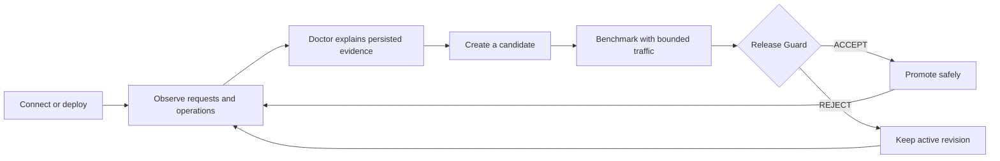

# Build, connect, and operate production inference

Start from a model, a custom OCI workload, or an endpoint you already run. InferCrane can own the
complete deployment lifecycle or add policy and evidence around existing infrastructure. Your
application keeps one OpenAI-compatible model name while providers, runtimes, and capacity plans
change behind it.

Qwen, Llama, Gemma, Kimi, and private fine-tunes all enter through the same model-artifact contract.
Support is evidence-based per model, runtime, accelerator, and provider combination—not a blanket
“every model everywhere” promise.

<CardGroup cols={3}>
  <Card title="Deploy from a model" icon="server" href="/showcase/build-inference">
    Turn a model and serving plan into a durable endpoint, then evolve it through immutable revisions.
  </Card>
  <Card title="Create an inference project" icon="folder-code" href="/features/inference-projects">
    Scaffold, validate, build, and deploy a reproducible workload from one project directory.
  </Card>
  <Card title="Connect without migrating" icon="plug" href="/showcase/connect-existing">
    Add health, request evidence, and deterministic diagnosis around an existing vLLM, LiteLLM, or OpenAI-compatible endpoint.
  </Card>
  <Card title="Compose your stack" icon="diagram-project" href="/showcase/gateways-and-sandboxes">
    Combine InferCrane with LiteLLM, governed OpenRouter overflow, or an application-managed agent sandbox.
  </Card>
  <Card title="Ship a safer revision" icon="shield-check" href="/showcase/safe-rollouts">
    Combine bounded performance validation with signed task-quality evidence and keep production unchanged when policy rejects it.
  </Card>
  <Card title="Handle uncertain capacity" icon="gauge-high" href="/showcase/capacity-evidence">
    Resume long operations, explain cold starts, compare measured serving plans, and govern external overflow.
  </Card>
</CardGroup>

## One stable application contract

<CodeGroup>
```python Python
from openai import OpenAI

client = OpenAI(
    base_url="https://infercrane.example/v1",
    api_key="${INFERCRANE_API_KEY}",
)

response = client.responses.create(
    model="coder-production",
    input="Review this function for concurrency bugs.",
)
```

```typescript TypeScript
import OpenAI from "openai";

const client = new OpenAI({
  baseURL: "https://infercrane.example/v1",
  apiKey: process.env.INFERCRANE_API_KEY,
});

const response = await client.responses.create({
  model: "coder-production",
  input: "Review this function for concurrency bugs.",
});
```

```bash cURL
curl https://infercrane.example/v1/responses \
  -H "Authorization: Bearer $INFERCRANE_API_KEY" \
  -H "Content-Type: application/json" \
  -d '{"model":"coder-production","input":"Review this function for concurrency bugs."}'
```
</CodeGroup>

`coder-production` is the stable product identity. A binding may resolve it to an InferCrane-managed
deployment, an adopted workload, or governed external capacity. Applications do not need provider
credentials or physical model names when the serving plan changes.

## Choose how much InferCrane owns

| Start here | InferCrane can observe | InferCrane can route | InferCrane can create or delete compute |
| --- | --- | --- | --- |
| `observe-only` connection | Yes | No | No |
| `traffic-managed` connection | Yes | Yes | No |
| lifecycle-managed deployment | Yes | Yes | Yes |

This ownership ladder lets a platform team prove value before handing over traffic or provider
lifecycle. Promotion is explicit; connecting an endpoint never silently changes production routing.

## The proof loop



InferCrane does not use an LLM to decide production promotion. Policy inputs, measurements, reason
codes, and revision identities are persisted so the result can be inspected and reproduced.

<Note>
Examples use qualified product surfaces, but infrastructure and runtime combinations have independent
evidence states. Check the [capability matrix](/project-status) before relying on a combination in
production.
</Note>
