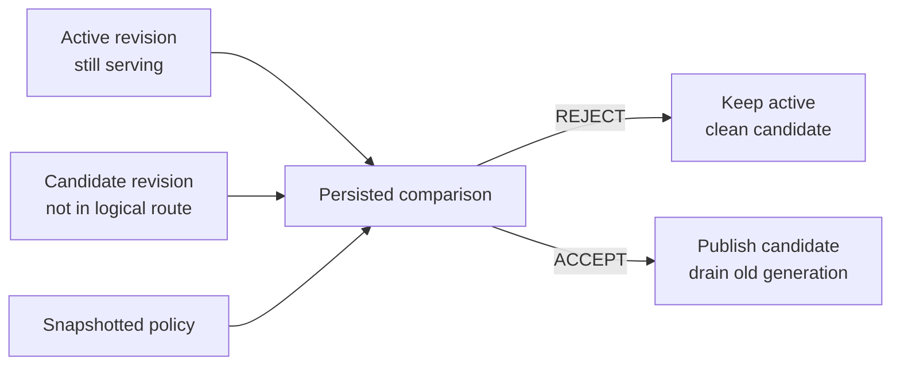

# Make “production remains unchanged” the default failure mode

An update creates an immutable candidate revision. It does not mutate the active revision in place.
Release Guard compares compatible, persisted active and candidate evidence before promotion.

```bash
infercrane plan deployment.yaml
infercrane apply deployment.yaml
```

Validate with explicit cost and privacy acknowledgement. Validation traffic is bounded by persisted
policy; InferCrane does not shadow or duplicate production requests silently.

```bash
infercrane rollout policy set qwen-prod \
  --require-compatibility \
  --require-synthetic \
  --validation-max-requests 100 \
  --validation-max-concurrency 4

infercrane rollout validate qwen-prod \
  --requests 100 \
  --concurrency 4 \
  --acknowledge-validation-cost \
  --wait

infercrane rollout inspect qwen-prod
```

```text
ACTIVE        rev-18
CANDIDATE     rev-19

Metric             Active       Candidate
TTFT p95             221ms           317ms

Guard: REJECT

Reason
TTFT regression +43%; maximum allowed +15%.
```

The values above illustrate the output shape; your result comes from persisted measurements. When
evidence is missing or incomparable, Release Guard returns `WAIT` instead of inventing a result.

## What the decision proves



Every evaluation records:

- active and candidate revision identity;
- the exact policy snapshot;
- compatible benchmark IDs and workload parameters;
- measurements that were available;
- explicit unavailable measurements;
- deterministic reason codes and timestamp.

Use the persisted decision during an incident or approval review:

```bash
infercrane explain rollout qwen-prod
infercrane rollout inspect qwen-prod --output json
```

<Tip>
After an accepted promotion, issue an [Inference Passport](/features/inference-passports) to bind the
revision to its release evidence in an independently verifiable artifact.
</Tip>
