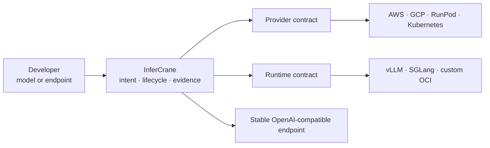

# The missing operational layer for inference

Getting one model to answer one request is straightforward. Keeping a stable endpoint healthy while
capacity is scarce, models take minutes to load, traffic changes, and revisions behave differently is
the hard part.

InferCrane gives teams one durable control plane for that operational gap. It builds or connects
inference, preserves application identity, records what happened, and makes risky changes explicit.

## Problems teams repeatedly encounter

| Production friction | What usually happens | InferCrane response |
| --- | --- | --- |
| A model works locally but deployment needs cloud scripts, a proxy, health checks, and state | Every team builds a fragile one-off platform | One deployment intent and a durable operation |
| GPU scaling requires several metrics and controllers | Scale-up arrives late; scale-down interrupts work | Bounded autoscaling, readiness-aware routing, and safe drain |
| Model download and startup take minutes | A terminal looks frozen and retries risk duplicate resources | Resumable operations with capacity, artifact, runtime, and readiness stages |
| A new model/runtime combination is trial and error | Container, tokenizer, chat template, quantization, or GPU fit fails late | Immutable artifacts, recipes, plans, benchmarks, and explicit qualification evidence |
| A candidate is healthy but slower or more expensive | “Ready” is mistaken for “safe to promote” | Release Guard compares persisted active and candidate evidence |
| Nobody can explain a latency regression | Operators correlate logs, metrics, provider consoles, and deploy history manually | Request Inspector and deterministic Doctor findings connect requests to revisions and events |
| Existing vLLM or LiteLLM works and migration is risky | A new platform demands replacement before showing value | Observe first, then explicitly transfer routing or lifecycle ownership |
| External fallback avoids downtime but can leak data or spend | Requests silently leave controlled infrastructure | Explicit privacy consent plus hard request and cost-reservation limits |

These patterns appear throughout current vLLM and Kubernetes operator discussions: autoscaling needs
multiple signals, cold-start lag dominates scale-out, and newly released models often require exact
runtime and configuration combinations. InferCrane does not pretend those constraints disappear; it
makes them observable and governable.

<Accordion title="Signals behind these priorities">
  The product priorities are grounded in upstream behavior and recurring operator reports, including
  [vLLM's production metrics](https://docs.vllm.ai/en/latest/design/metrics/),
  [Kubernetes autoscaling behavior](https://kubernetes.io/docs/tasks/run-application/horizontal-pod-autoscale/),
  community reports about the [number of moving parts in GPU autoscaling](https://www.reddit.com/r/kubernetes/comments/1sd7zyr/keda_gpu_scaler_autoscale_vllmtriton_inference/),
  [cold-start lag and queue signals](https://www.reddit.com/r/mlops/comments/1rknjhe/scaling_vllm_inference_queue_depth_as_autoscaling/),
  and [trial-and-error model/runtime combinations](https://www.reddit.com/r/Vllm/comments/1vap86g/how_many_attempts_does_it_normally_take_you_to/).
  Community discussions are product-discovery signals, not proof of InferCrane performance.
</Accordion>

## What InferCrane replaces—and what it keeps

InferCrane replaces handwritten lifecycle glue, not the infrastructure ecosystem:

- SkyPilot or provider APIs continue provisioning infrastructure.
- vLLM, SGLang, or custom runtimes continue executing inference.
- vLLM Router continues distributing requests among standalone replicas.
- AIPerf continues generating benchmark load.
- Hugging Face Hub/Xet continues resolving and transferring model artifacts.
- OpenTelemetry conventions continue defining portable telemetry.

InferCrane owns the stable endpoint, desired and observed state, durable operations, revisions,
rollout policy, evidence, explanations, and adapter qualification.

## Choose InferCrane when

- You want to operate open-weight or custom inference on infrastructure you control.
- You already run vLLM or an OpenAI-compatible gateway and need safer operations without migration.
- You need asynchronous deploy/update/delete operations that survive a disconnected CLI.
- You need evidence before promoting a runtime, model, GPU, or provider change.
- You want provider and runtime portability without adopting a universal lowest-common-denominator API.

## Do not choose InferCrane when

- You want a hosted model API with no infrastructure account or control plane to operate.
- You need training, fine-tuning orchestration, a generic workflow engine, or an agent framework.
- You expect every model/runtime/provider combination to be supported without qualification.
- You require InferCrane-managed sandbox execution; sandboxes are currently application-managed.
- You need a production claim for an adapter marked experimental or locally qualified only.

<CardGroup cols={3}>
  <Card title="Deploy a model" icon="server" href="/showcase/build-inference">
    Start from a model artifact or immutable OCI workload.
  </Card>
  <Card title="Connect what runs" icon="plug" href="/showcase/connect-existing">
    Gain evidence without transferring lifecycle ownership.
  </Card>
  <Card title="Check capability evidence" icon="clipboard-check" href="/project-status">
    See exactly what is implemented, qualified, experimental, or planned.
  </Card>
</CardGroup>
